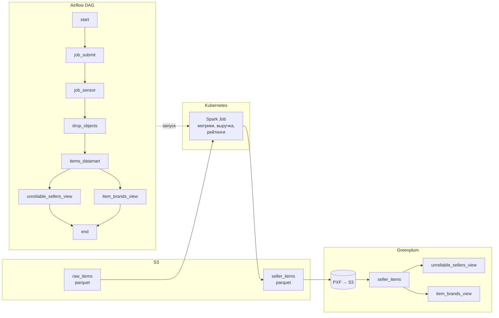

# Marketplace Items & Sellers Analytics

Пайплайн аналитики товаров и продавцов маркетплейса: обработка сырых данных в Apache Spark, загрузка в Greenplum и построение отчётных представлений (views).

## Схема пайплайна



## Что делает проект

1. **Spark Job** читает parquet-данные товаров из S3, вычисляет метрики (выручка, возвраты, средние продажи, рейтинг в перцентилях) и сохраняет результат обратно в S3 в формате parquet.
2. **Airflow DAG** по расписанию:
   - запускает Spark-задачу в Kubernetes;
   - дожидается её завершения;
   - пересоздаёт в Greenplum внешнюю таблицу и два представления:
     - **seller_items** — внешняя таблица поверх parquet в S3 (PXF);
     - **unreliable_sellers_view** — продавцы с признаком «ненадёжный» (долго на продаже, избыток остатков);
     - **item_brands_view** — агрегация по брендам (потенциальная/фактическая выручка, количество товаров).

## Стек технологий

- **Apache Airflow** — оркестрация DAG
- **Apache Spark (PySpark)** — обработка данных
- **Kubernetes** — запуск Spark-приложения (Spark on K8s)
- **Greenplum** — хранилище и аналитические представления
- **S3-совместимое хранилище** — сырые и обработанные данные (parquet)

## Структура репозитория

```
.
├── dags/
│   └── marketplace/
│       └── marketplace_items_sellers_dag.py   # Airflow DAG
├── spark_jobs/
│   └── marketplace_items_metrics/
│       ├── job.py                            # Spark-задача (PySpark)
│       └── application.yaml                 # манифест SparkApplication для K8s
├── .env.example                              # шаблон переменных окружения
├── .gitignore
├── requirements.txt                         # зависимости (Airflow, Spark)
├── README.md
└── SECURITY.md                              # рекомендации по секретам
```

## Требования

- Python 3.8+
- Доступ к S3-совместимому хранилищу (или локальные пути для тестов)
- Для полного пайплайна: Airflow с провайдерами Kubernetes и Greenplum, кластер K8s с Spark Operator, Greenplum с PXF для доступа к S3

## Шаги к запуску

### 1. Клонирование и зависимости

```bash
git clone https://github.com/Waterline98/Marketplace-Items-Sellers-Analytics.git
cd Marketplace-Items-Sellers-Analytics
```

Установка зависимостей (для локального запуска DAG и/или Spark):

```bash
pip install -r requirements.txt
```

Для Spark job дополнительно нужна Java (JRE 8/11), если запускаете `spark-submit` локально.

### 2. Конфигурация

Скопируйте шаблон переменных окружения и заполните своими значениями:

```bash
cp .env.example .env
```

Отредактируйте `.env`. Обязательные переменные:

| Переменная | Описание |
|------------|----------|
| `S3_ENDPOINT` | URL эндпоинта S3 (или S3-совместимого хранилища) |
| `S3_REGION` | Регион (например, `ru-msk`) |
| `AWS_ACCESS_KEY_ID` | Ключ доступа |
| `AWS_SECRET_ACCESS_KEY` | Секретный ключ |
| `INPUT_ITEMS_PATH` | Путь к сырым parquet (например, `s3a://bucket/raw_items`) |
| `TARGET_PATH` | Путь для записи результата (например, `s3a://bucket/workdir/seller_items`) |

Для работы DAG в Airflow нужны также:

| Переменная | Описание |
|------------|----------|
| `K8S_SPARK_NAMESPACE` | Namespace в Kubernetes для Spark-задач |
| `K8S_CONNECTION_ID` | ID подключения Kubernetes в Airflow |
| `GREENPLUM_ID` | ID подключения Greenplum в Airflow |
| `GP_SCHEMA_NAME` | Схема в Greenplum для таблиц и представлений |
| `GP_EXTERNAL_LOCATION` | PXF-локация для внешней таблицы (путь к parquet в S3) |

Файл `.env` не коммитить в репозиторий (он указан в `.gitignore`).

### 3. Запуск Spark job локально (без Airflow и K8s)

Убедитесь, что в `.env` заданы переменные для S3 и путей. Затем:

```bash
# Если Spark установлен глобально
spark-submit \
  --packages org.apache.hadoop:hadoop-aws:3.3.2 \
  spark_jobs/marketplace_items_metrics/job.py
```

Либо запуск через Python (если Spark настроен через PySpark):

```bash
cd spark_jobs/marketplace_items_metrics
python job.py
```

Перед запуском загрузите переменные из `.env` (например, экспортируйте их в shell или используйте `load_dotenv()` в скрипте — в `job.py` уже есть `load_dotenv()`).

### 4. Запуск через Airflow

1. Установите и настройте Airflow с провайдерами:
   - `apache-airflow-providers-cncf-kubernetes`
   - провайдер для Greenplum (например, `apache-airflow-providers-postgres` или ваш коннектор).

2. Создайте в Airflow:
   - Connection для Kubernetes (`K8S_CONNECTION_ID`);
   - Connection для Greenplum (`GREENPLUM_ID`);
   - при необходимости — Variable `marketplace_dag_alert_emails` (список email через запятую для алертов).

3. Передайте переменные окружения DAG (например, через Airflow Variables или через environment в Docker/ K8s), как в `.env.example`:
   - `K8S_SPARK_NAMESPACE`, `K8S_CONNECTION_ID`, `GREENPLUM_ID`, `GP_SCHEMA_NAME`, `GP_EXTERNAL_LOCATION`.

4. Положите папку `dags/` в каталог DAG Airflow (или смонтируйте репозиторий). DAG появится под именем `marketplace_items_sellers_analytics_dag`.

5. Расписание: по умолчанию — ежедневно в 02:00 UTC (`0 2 * * *`).

### 5. Запуск Spark в Kubernetes (по манифесту)

Манифест `spark_jobs/marketplace_items_metrics/application.yaml` использует плейсхолдеры (например, `${IMAGE_REPO}`, `${SPARK_VERSION}`, `${SCRIPT_PATH}`, `${GIT_REPO_URL}`, `${SERVICE_ACCOUNT}`). Перед применением подставьте свои значения (через `envsubst` или CI/CD). В контуре Airflow подстановку обычно выполняет оператор или скрипт деплоя.

## Описание DAG

- **start** → **job_submit** (SparkKubernetesOperator): отправка Spark-приложения в K8s.
- **job_submit** → **job_sensor** (SparkKubernetesSensor): ожидание завершения Spark job.
- **job_sensor** → **drop_objects**: удаление старых view и внешней таблицы в Greenplum.
- **drop_objects** → **items_datamart**: создание внешней таблицы `seller_items` на PXF.
- **items_datamart** → **create_unreliable_sellers_report_view** и **create_brands_report_view** → **end**.

Параметры: retries=3, retry_delay=5 мин, SLA 3 часа, email при падении (если заданы адреса в Variable `marketplace_dag_alert_emails`).

## Метрики в Spark job

На основе входных полей (например, `ordered_items_count`, `item_price`, `avg_percent_to_sold`, `goods_sold_count`, `days_on_sell`, `availability_items_count`) считаются:

- `returned_items_count` — оценка количества возвратов;
- `potential_revenue`, `total_revenue` — потенциальная и фактическая выручка;
- `avg_daily_sales`, `days_to_sold` — средние продажи в день и оценка «дней до продажи» остатка;
- `item_rate_percent` — перцентиль рейтинга товара.

## Вклад в проект

Предложения по улучшению приветствуются: создавайте Issue или Pull Request в репозитории.
